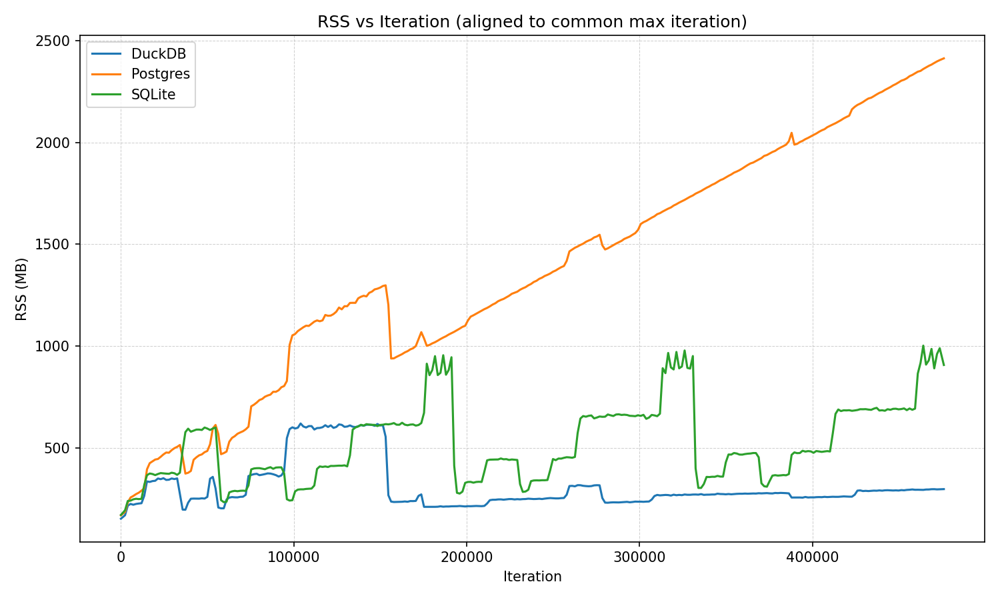

# DuckDB Memory Leak Investigation Tool

This tool helps investigate memory leaks in DuckDB Node.js applications by running continuous queries against different data sources and monitoring memory usage patterns.

# TLDR

Snapshot from a test with 1.2.0-alpha.15




## Setup

### 1. Install Dependencies

```bash
npm install
```

### 2. PostgreSQL Setup (for postgres tests)

Create the test database:

```sql
-- Connect to PostgreSQL as superuser
CREATE DATABASE duckdb_memory_test;
GRANT ALL PRIVILEGES ON DATABASE duckdb_memory_test TO postgres;
```

The script will automatically create the test table and data.

### 3. Node.js Configuration

For garbage collection testing, run with:

```bash
node --expose-gc memory_test.js
```

## Usage

### Quick Start

```bash
# Test all modes sequentially
npm run test

# Test specific mode
npm run test:duckdb     # Pure DuckDB queries
npm run test:sqlite     # DuckDB -> SQLite queries
npm run test:postgres   # DuckDB -> PostgreSQL queries

# Test with different configurations
npm run test:fast       # Query every 1 second
npm run test:slow       # Query every 10 seconds
npm run test:new-conn   # New connection per query
npm run test:gc         # With garbage collection
npm run test:limit      # Limited to 100 iterations
```


## Results

After running tests, you’ll have large JSON logs like:

```
memory\_stats\_duckdb\_*.json
memory\_stats\_postgres\_*.json
memory\_stats\_sqlite\_\*.json
```

### Visualizing & Comparing Memory (Python helper)

This repo includes a Python helper, `mem_compare.py`, and a small HTML page to visualize results.

- **Aligns** series by the max common iteration (apples-to-apples)
- **Downsamples** (bucket average) to a target number of points
- Outputs a **PNG plot** and/or a compact **reduced.json** for web use

#### Quick usage

```bash
# Plot RSS (MB) for all three logs (outputs plot.png)
./mem_compare.py memory_stats_*.json --output-plot plot.png --target-points 300

# Create a compact JSON for the web (outputs reduced.json)
./mem_compare.py memory_stats_*.json --output-json reduced.json --target-points 400

# Use a different metric (heapUsed, heapTotal, external, arrayBuffers)
./mem_compare.py memory_stats_*.json --metric heapUsed --output-plot heap_used.png
```

#### Local web view (avoids CORS)

The HTML page (`memory_compare_template.html`) loads `reduced.json` and renders an interactive Plotly chart. Serve both files from the same directory:

```bash
# In the project root (or the folder containing memory_compare_template.html and reduced.json)
python3 -m http.server 8080
```

Then open:

```
http://localhost:8080/memory_compare_template.html
```

**Tip:** If you prefer a different port, change `8080`.

```

### Environment Variables

| Variable | Default | Description |
|----------|---------|-------------|
| `TEST_MODE` | `all` | Test mode: `duckdb`, `sqlite`, `postgres`, or `all` |
| `QUERY_INTERVAL` | `5000` | Milliseconds between queries |
| `MAX_ITERATIONS` | `0` | Max iterations (0 = infinite) |
| `MEMORY_INTERVAL` | `10000` | Memory monitoring interval (ms) |
| `NEW_CONNECTION` | `false` | Create new connection per query |
| `FORCE_GC` | `false` | Force garbage collection (requires --expose-gc) |
| `DUCKDB_MEMORY_LIMIT` | `500MB` | DuckDB memory limit |
| `DUCKDB_THREADS` | `2` | DuckDB thread count |
| `PG_HOST` | `127.0.0.1` | PostgreSQL host |
| `PG_PORT` | `5432` | PostgreSQL port |
| `PG_DB` | `duckdb_memory_test` | PostgreSQL database |
| `PG_USER` | `postgres` | PostgreSQL user |
| `PG_PASSWORD` | `` | PostgreSQL password |
| `SQLITE_FILE` | `./test_memory.db` | SQLite file path |

### Advanced Usage Examples

```bash
# Test PostgreSQL scanner with new connections and GC
TEST_MODE=postgres NEW_CONNECTION=true FORCE_GC=true node --expose-gc memory_test.js

# Fast testing with limited iterations
QUERY_INTERVAL=1000 MAX_ITERATIONS=500 TEST_MODE=postgres node memory_test.js

# Memory-constrained testing
DUCKDB_MEMORY_LIMIT=100MB MEMORY_INTERVAL=5000 npm run test:postgres

# Custom PostgreSQL connection
PG_HOST=192.168.1.100 PG_USER=testuser PG_PASSWORD=secret npm run test:postgres
```

## What It Tests

### Test Queries

The script runs complex analytical queries that include:
- Aggregations (COUNT, AVG, MIN, MAX, STDDEV)
- Window functions (ROW_NUMBER)
- CTEs (Common Table Expressions)
- Cross joins
- Subqueries

### Memory Monitoring

Tracks:
- RSS (Resident Set Size)
- Heap Total/Used
- External memory
- Array buffers
- Query execution time
- Iteration count

### Test Scenarios

1. **DuckDB Only**: Pure in-memory DuckDB operations
2. **DuckDB + SQLite**: Tests the SQLite scanner
3. **DuckDB + PostgreSQL**: Tests the PostgreSQL scanner (suspected leak source)

## Output

### Console Output

```
🧪 DuckDB Memory Leak Investigation Tool
=====================================

🦆 Setting up DuckDB...
✅ DuckDB setup complete
🐘 Setting up PostgreSQL connection...
✅ PostgreSQL setup complete

🚀 Starting memory leak test - Mode: POSTGRES
📋 Config: {
  queryInterval: 5000,
  maxIterations: 'infinite',
  newConnectionPerQuery: false,
  forceGC: false
}

📊 Memory - RSS: 145.23MB, Heap: 12.45/89.12MB, External: 2.34MB

🔄 Iteration 1 (POSTGRES)
✅ POSTGRES query completed in 234ms, returned 1 rows
```

### Memory Statistics File

The tool saves detailed memory statistics to JSON files:

```json
{
  "config": { ... },
  "stats": [
    {
      "timestamp": 1709123456789,
      "iteration": 1,
      "rss": 152453120,
      "heapTotal": 93552640,
      "heapUsed": 13045672,
      "external": 2456789,
      "arrayBuffers": 1234567
    }
  ],
  "summary": {
    "duration": 300000,
    "iterations": 60,
    "initialMemory": { ... },
    "finalMemory": { ... }
  }
}
```

## Investigation Tips

### For Memory Leaks

1. **Baseline Test**: Run DuckDB-only test first to establish baseline
2. **Comparison**: Compare memory growth between modes
3. **Connection Strategy**: Test both reused and new connections
4. **GC Impact**: Test with forced garbage collection
5. **Query Frequency**: Test different intervals to isolate the leak

### Monitoring Commands

```bash
# Monitor process memory externally
watch -n 5 'ps aux | grep node'

# Monitor system memory
watch -n 5 'free -h'

# Check for memory fragmentation (Linux)
cat /proc/buddyinfo

# Monitor huge pages (if applicable)
cat /proc/meminfo | grep Huge
```

### Analyzing Results

Look for:
- **Steady Growth**: Memory that increases over time without plateauing
- **Step Growth**: Memory that increases in discrete steps
- **No Recovery**: Memory that doesn't decrease after GC
- **Mode Differences**: Different growth patterns between test modes

## Troubleshooting

## Analysis Tooling (Python)

### Files
- `mem_compare.py` — CLI to align, downsample, and either plot or emit `reduced.json`
- `memory_compare_template.html` — loads `reduced.json` and renders a Plotly line chart

### Typical workflows

**1) Fast static comparison (PNG)**
```bash
./mem_compare.py memory_stats_*.json --output-plot plot.png --target-points 300
```

**2) Interactive browser view**

```bash
./mem_compare.py memory_stats_*.json --output-json reduced.json --target-points 400
python3 -m http.server 8080
# Open http://localhost:8080/memory_compare_template.html
```

**3) Alternate metric**

```bash
./mem_compare.py memory_stats_*.json --metric heapUsed --output-plot heap_used.png
```

### Notes

* The script infers labels from filenames: **DuckDB**, **SQLite**, **Postgres**.
* By default it trims to the **max common iteration** across inputs for fair comparison.
* Use `--no-align` if you want to compare full, unmatched ranges.
* Units in plots/JSON are **MB** for byte-like metrics.

### Example JSON (reduced)

```json
{
  "metric": "rss",
  "unit": "MB",
  "series": [
    {"label": "DuckDB", "points": [{"iteration": 0, "value": 103.2}]},
    {"label": "Postgres", "points": [{"iteration": 0, "value": 110.1}]},
    {"label": "SQLite", "points": [{"iteration": 0, "value": 98.7}]}
  ]
}
```

### PostgreSQL Connection Issues

```bash
# Test connection manually
psql -h 127.0.0.1 -U postgres -d duckdb_memory_test -c "\dt"
```

### SQLite Permission Issues

```bash
# Ensure write permissions
chmod 666 ./test_memory.db
```

### Node.js Memory Issues

```bash
# Increase Node.js memory limit
node --max-old-space-size=4096 memory_test.js
```

## Stopping the Test

- **Ctrl+C**: Graceful shutdown with memory statistics saved
- **SIGTERM**: Also triggers graceful shutdown
- The tool automatically saves memory statistics to timestamped JSON files

## Expected Behavior

- **Normal**: Memory may increase initially then stabilize
- **Leak**: Continuous growth without stabilization
- **PostgreSQL Scanner Issue**: Higher growth rate in postgres mode vs others

